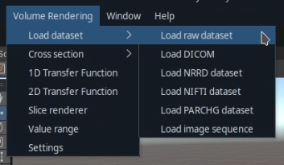
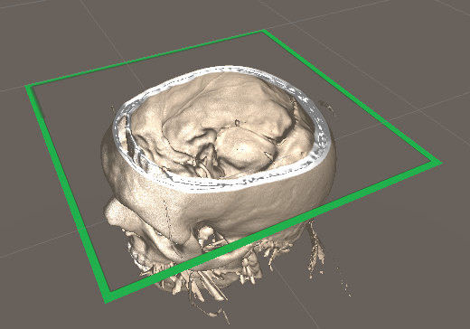
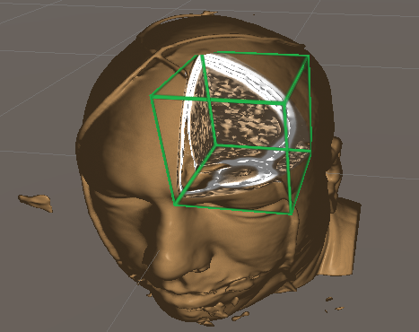
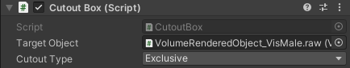
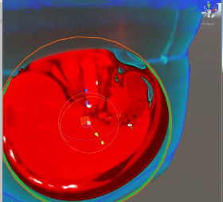

# Cross section tools

**Table of contents:**
<!-- TOC -->

- [Cross section tools](#cross-section-tools)
    - [Cross section plane](#cross-section-plane)
    - [Box cutout](#box-cutout)
    - [Sphere cutout](#sphere-cutout)

<!-- /TOC -->

You can spawn cross section tools from the Volume Rendering menu option.

There are three types of cross section tools:

## Cross section plane

The cross section plane is a simple plane that can be moved around and rotate, to clip the volume at an arbitrary position and angle.

If you need axis aligned clipping planes, I would recommend to implement your own clipping plane tool that implements the `CrossSectionObject` interface, and add it to the `CrossSectionManager`. 

## Box cutout

The box cutout tool spawns a box that you can move around and roate to do a box cutout on a dataset.

The tool has two modes:
- Exclusive: Cuts out everything that overlaps the box.
- Inclusive: Cuts out everything that is outside the box.

You can change these modes by selecting the "CutoutBox" GameObject in the hierarchy and changing the settings in the inspector:

## Sphere cutout

The sphere cutout tool spawns a sphere that you can move around and roate to do a sphere cutout on a dataset.

The tool works the same as the box cutout, and also has two modes: inclusive and exclusive.
