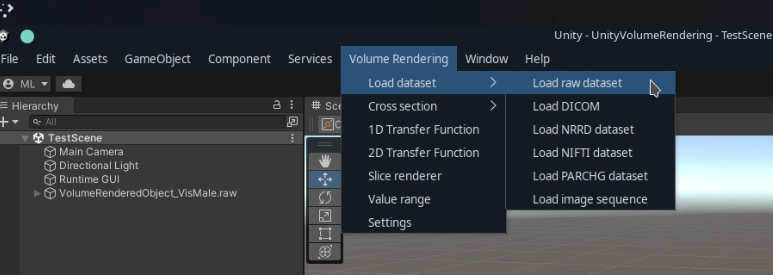
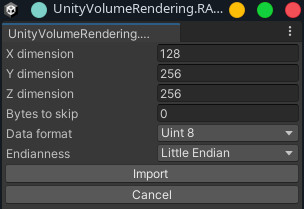
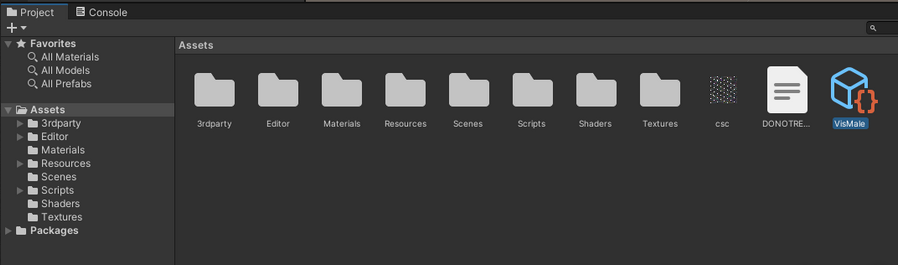
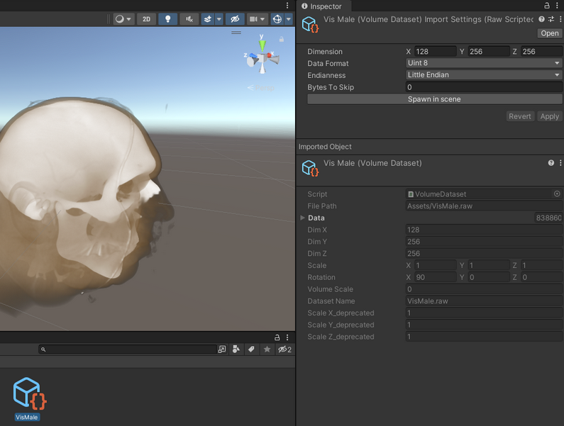
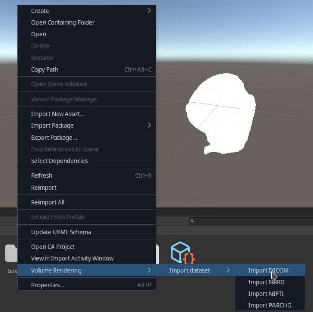

# Importing datasets in the editor

**Table of contents:**
<!-- TOC -->

- [Importing datasets in the editor](#importing-datasets-in-the-editor)
    - [Importing datasets through the "Volume Rendering" menu bar option](#importing-datasets-through-the-volume-rendering-menu-bar-option)
        - [Raw datasets](#raw-datasets)
            - [ini files](#ini-files)
        - [DICOM datasets](#dicom-datasets)
        - [NRRD datasets](#nrrd-datasets)
        - [NIfTI datasets](#nifti-datasets)
        - [VASP/PARCHG datasets](#vaspparchg-datasets)
        - [Image sequence datasets](#image-sequence-datasets)
    - [Importing datasets by drag and drop into the assets folder](#importing-datasets-by-drag-and-drop-into-the-assets-folder)
    - [Importing datasets by right clicking in the Assets folder](#importing-datasets-by-right-clicking-in-the-assets-folder)
- [Coordinate system and real size](#coordinate-system-and-real-size)

<!-- /TOC -->

For documentation on how to import datasets from code, see [Importing datasets form code](../../Scripting/Importing.md).

There are several ways to import datasets into the editor:
1. [Through "Volume Rendering" -> "Load dataset" in the menu bar.](#importing-datasets-through-the-volume-rendering-menu-bar-option)
2. [By drag-and-drop dataset into the "Assets" directory](#importing-datasets-by-drag-and-drop-into-the-assets-folder) (only RAW/NRRD/NIFTI, Unity 2020.2+)
3. [Right click in "Assets" directory and choose "Volume Rendering" -> "Import dataset"](#importing-datasets-by-right-clicking-in-the-assets-folder)

## Importing datasets through the "Volume Rendering" menu bar option

Click "Volume Rendering" in the menu bar and then "Load dataset" and select which dataset you want to import

### Raw datasets

For raw datasets you simply select a single file to import.

An import settings menu will then pop up Here you can set the import setting for the raw dataset. For the included sample files you don't need to change anything.

The available settings are:
- X dimension: Number of voxels/pixels in the x dimension (this may be the row count)
- Y dimension: Number of voxels/pixels in the y dimension (this may be the column count)
- Z dimension: Number of voxels/pixels in the z dimension (this may be the slice count)
- Bytes to skip: If the dataset contains a header, this should be the size of that header - else it should be 0.
- Data format: The format of the voxel data. This will usually be specified somewhere, either in a header or in some documentation for the dataset. You can replace "char" with "int" here (and "uchar" with "uint").
- Endianness: Usually "little endian"

#### .ini files

If the folder contains a ".ini" with the same name (dataset.raw => dataset.raw.ini) then this will be used to populate the import settings with some default values. so you don't have to do it every time you import the same dataset.

For an example .ini file, see [VisMale.raw.init](../../../DataFiles/VisMale.raw.ini).

### DICOM datasets

To import a DICOM dataset, click "Load DICOM" and select the folder where the DICOM dataset is loaded.

If the folder contains multiple series, these will be loaded as separate objects.

**Note:** If you are or Windows or Linux it is recommended to [enable the SimpleITK importer](../../SimpleITK/SimpleITK.md), which is a requirement for JPEG2000 compressed DICOM and NRRD.

### NRRD datasets

To import an NRRD dataset, click "Load NRRD dataset" and select the .nrrd file to import.

**Note:** To import NRRD datasets you need to [enable the SimpleITK importer](../../SimpleITK/SimpleITK.md).

### NIfTI datasets

To import a NIfTI dataset, click "Load NIFTI dataset" and select the .nii/.nii.gz file to import.

**Note:** If you are or Windows or Linux it is recommended to [enable the SimpleITK importer](../../SimpleITK/SimpleITK.md), which should work better overall.

### VASP/PARCHG datasets

To import a VASP dataset, click "Load PARCGH dataset" and select the file to import.

### Image sequence datasets

Some datasets will be stored as a series of image files (similar to DICOM, but in .jpg/.png/.tiff format), where each image represents a slice. These are referred to as "image sequence" datasets.

To import an image sequence, click "Load image sequence" and select the folder containing the slices.

## Importing datasets by drag and drop into the assets folder

To import a RAW/NRRD/NIFTI/PARCHG dataset (not DICOM or other image sequences), you can simply drag and drop the dataset file into the "Assets" directory.

This will create a new Asset file for the dataset.

For RAW datasets you can change the import settings by clicking on the asset, changing the import settings in the inspector and clicking "Apply".

To use these datasets, you can either:
- Drag and drop the dataset asset into the scene view or scene hierarchy view in the editor (Unity 2021.2 or newer)
- Spawn from code: Referencing the `VolumeDataset` asset somewhere in code, or through the Resources folder, and spawn it using the [VolumeObjectFactory](../../Scripting/Importing.md).

## Importing datasets by right clicking in the Assets folder

You can also import datasets by right clicking in "Assets" directory and choosing "Volume Rendering" -> "Import dataset"

All datasets (also DICOM) can be imported this way.

Using the imported dataset assets works the same as for [datasets imported by drag and drop](#importing-datasets-by-drag-and-drop-into-the-assets-folder)

# Coordinate system and real size

Coordinate systems are handled for DICOM and NRRD, and we convert to Unity's coordinate system using metre units.

By default import datasets will have their size normalised. If you wish to keep the original size (so multiple datasets will fit well together), you can select the outer GameObject (the ones that has a `VolumeRenderedObject` component), and set its scale to (1,1,1).
