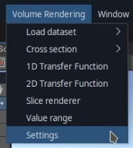
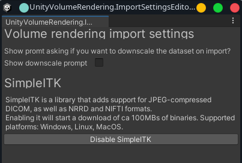

# Settings window

This window exposes some dataset and import-related settings, for using the plugin in the Editor.

## How to open the settings window

You can open the settings window from the "Volume Rendering" menu bar option:

## Available settings

### Show downscale prompt

When this setting is enabled, you will see a promt asking you if you wish to downscale the dataset every time you import a dataset in the editor.

Imported datasets are automatically downscaled if they are too large to fit into a 3D texture. However, in some cases you may wish to downscale it even if this is not a problem (to save memory, etc.).

### Enable SimpleITK

If you're on Windows/Linux/Mac, you can optionally enable the SimpleITK-based importer.

This has a couple of advantages:
- Better DICOM support (faster import, and fewer issues)
- JPEG2000 compressed DICOM support
- NRRD support
- Better NIFTI support
- Support for image sequence datasets in TIFF format

It is recommeneded to enable this if you don't only use RAW datasets.

This is a native plugin, so to support other platforms you would need to build it yourself.
