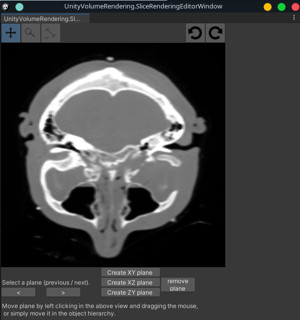
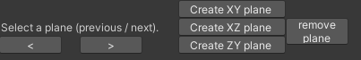
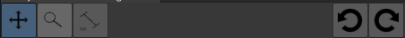
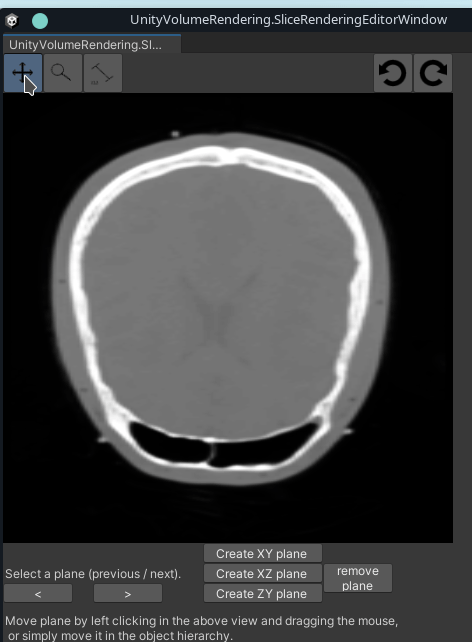

# Slice renderer

The slice renderer can be used to create a axis aligned (or free transform) slice view of a dataset.

## How to open the slice renderer window

You can open the slice renderer window from the "Volume Rendering" menu bar option:

## Creating slicing planes

To create a new slice renderer, click one of the "Create plane" buttons.

The buttons to the left can be used to navigate between different slices.

## Rotating the slice view

At the top of the window there are some more buttons.

The two rightmost buttons can be used to rotate the slice view 90 degrees.

## Moving and measuring the slices

The three buttons to the top left will change the current interaction mode:
- **Move slice**: Left click + drag mouse up/down => Slice moves forwards/backwards
- **Inspect values**: Left click somewhere in the view, and the value will be printed in the bottom left corner.
- **Measure distances**: Left click and drag mouse to measure a linear distance. The value will be printed at the bottom left corner.

