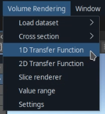
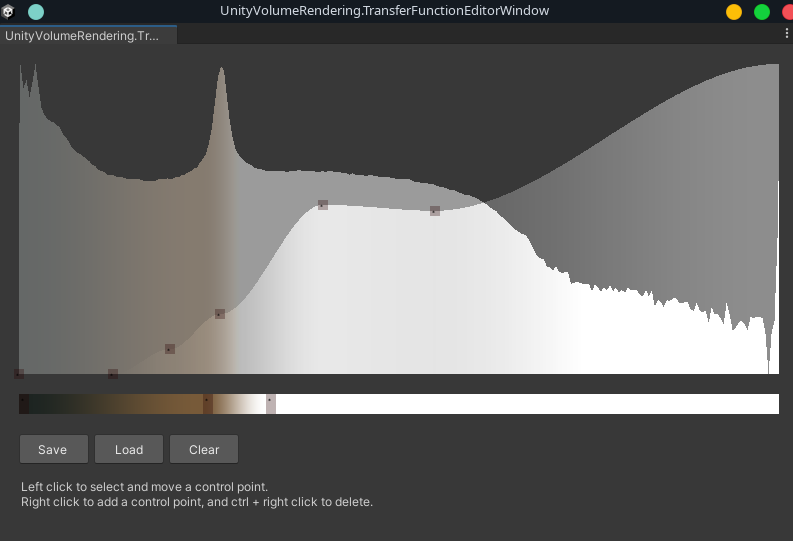
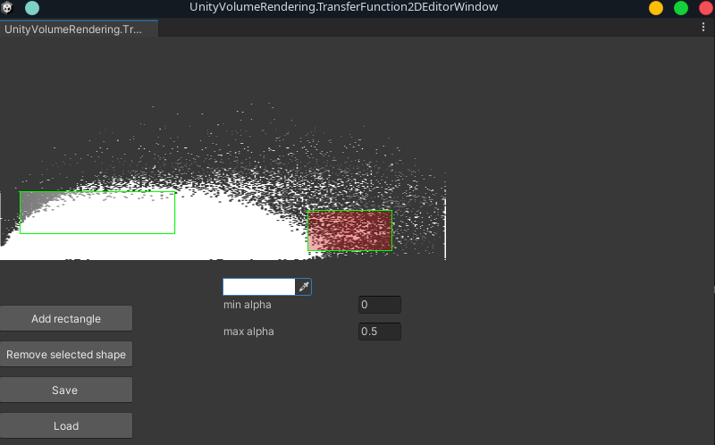

# Transfer functions

You can use transfer functions to apply different colours and opacities to different parts of the dataset, resulting in more interesting visualisations.

Ttransfer functions will map density (and optionally gradient magnitude) to a selected colour/opacity, enabling you to highlight parts of the dataset (skin, bones, etc.).

You can open the transfer function editors from the "Volume Rendering" menu bar option in the editor:

##  1. 1-Dimensional transfer functions

This is the simplest type of transfer function to work with. It maps density values to a selected colour and opacity (transparency).

The axes:
- X-axis: Represents density values.
- Y-axis: Represents alpha values (opacity).

How to use:
- Move the grey alpha knots to create a curve for opacity by density.
    - Right-click to add new alpha knots.
- The bottom gradient-coloured panel maps colour to density. Here you can select which colour a part of the dataset should have, based on the density values of the voxels.
    - Right-click to add new knots and click on an existing colour knot to modify its colour.

##  2. 2-Dimensional transfer functions

**Note: The 2D TF editor is still work-in-progress.** I plan to improve it further. Suggestions and feedback is very welcome! ([create an issue](https://github.com/mlavik1/UnityVolumeRendering/issues/new) or [start a discussion thread](https://github.com/mlavik1/UnityVolumeRendering/discussions)).

The axes:
- X-axis: Represents density
- Y-axis: Represents gradient magnitude.

How to use:
- Click "add rectangle" to add a new rectangle-shape.
    - Click on the rectangle and drag to move it. 
    - Drag the edges of the rectangle to change its shape.
- Click on the colour picker to change the colour of the selected rectangle shape.
- Change the "min alpha" and "max alpha" sliders to change the minimum and maximum opacity of the selected shape.
    - The "max alpha" defines the opacity value at the centre of the shape.
    - The "min alpha" defines the opacity value at the edges of the shape.
