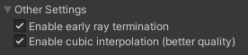

# Volume rendering appearance settings

**Table of contents:**
<!-- TOC -->

- [Cross section tools](#cross-section-tools)
    - [Cross section plane](#cross-section-plane)
    - [Box cutout](#box-cutout)
    - [Sphere cutout](#sphere-cutout)

<!-- /TOC -->

To modify the appearance settings of a volume rendered dataset, simply select the object in the scene / scene hierarchy - and you will find the appearance settings under "Volume Rendered Object" in the inspector.

## Render mode

There are 3 render modes:
- Direct Volume Rendering (raymarching, using transfer functions)
- Maximum Intensity Projection (shows the maximum density)
- Isosurface Rendering (raymarching, stops when it hits a surface)

## Lighting

You can enable lighting to get more realistic visualisation.

This comes at a cost, and performance may suffer (both memory and rendering speed).

To apply lighting to the volume rendering, we calculate the gradient at each voxel and use this to calculate a normal, which we use to apply phong lighting.

## Cubic interpolation

To reduce so-called "staircase artifacts", you can enable cubic interpolation.

This can be quite expensive in terms of performance - especially when lighting is enabled!

# Early ray termination

To improve performance, the raymarching shader may optionally exit early when enough samples have been accumulated.
This is a very simple optimisation that improves performance by avoiding enumeration of invisible voxels.

You usually want to leave this setting enabled, since it improves performance considerably - usually without any noticable visual changes.
