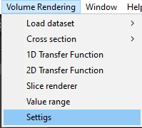
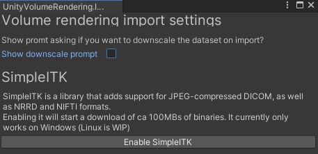

# SimpleITK

SimpleITK is a library that supports a wide range for formats, such as:
- DICOM (with JPEG compression)
- NRRD
- NIFTI

This project optionally uses SimpleITK for the above formats. There is another fallback DICOM importer, but SimpleITK is a requirement for NRRD and for JPEG2000 compressed DICOM datasets.

Since SimpleITK is a native library, that requires you to download some large binaries for each target platform, it has been disabled by default.

To enable SimpleITK, you simply have to do the following:
1. In Unity's top toolbar, click "Volume rendering" and then "Settings", to open the settings menu.
2. In the settings menu, click "Enable SimpleITK"

This will automatically download the SimpleITK binaries, and enable support for SimpleITK in the code. The `ImporterFactory` class will then return the SimpleITK-based importer implementations.

## Supported platforms

Currently the SimpleITK integration supports Windows, Linux and MacOS. To use it on other platforms you could probably try building [the official C# wrapper](https://github.com/SimpleITK/SimpleITK/tree/master/Wrapping/CSharp) for that platform, or manually download the SimpleITK binaries for that platform and create your own C# wrapper. However, I'll look into distributing binaries for at least Linux (which is what I use as a daily driver).

Note: If you wish to enable SimpleITK, you currently need to create the build on the same platform as your target platform. If you wish to create a Linux build on Windows, you would need to manually download the SimpleITK Linux binaries before you build.
