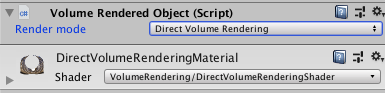

# UnityVolumeRendering
A volume renderer, made in Unity3D.
I have written a [tutorial explaining the basic implementation](https://matiaslavik.wordpress.com/2020/01/19/volume-rendering-in-unity/).
Have any questions? [Find my contact info here](https://matiaslavik.wordpress.com/contact-me/).

I also have [a tutorial video that shows how to use the project](https://bittube.video/videos/watch/d9f34e1e-ee05-41fe-85de-7429d76f5de1)

# Requirements:
- Unity 2018 1.5 or newer (should also work with some older versions, but I haven't tested)

# How to use sample scene
- Open "TestScene.unity"
- Click "Volume Rendering" in the menu bar
- Select "Load Asset"
- Pick a file in the "DataFiles" folder (I recommend manix.dat)
- Click the "import"-button

# Step-by-step instructions
**1. Import model**

**Raw datasets:**

In the menu bar, click "Volume Rendering" and "Load raw dataset"

Then select the dataset you wish to import. Currently only raw datasets are supported (you can add your own importer for other datasets).

In the next menu you can optionally set the import setting for the raw dataset. For the sample files you don't need to change anything.

**DICOM:**

To import a DICOM dataset, click "Volume Rendering" and "Load DICOM" and select the folder containing your DICOM files.
The dataset must be of 3D nature, and contain several files - each being a slice along the Z axis.

**2. Moving the model**

You can move the model like any other GameObject. Simply select it in the scene view or scene hierarchy, and move/rotate it like normal.

**3. Changing the visualisation**

Select the model and find the "Volume Render Object" in the inspector.

Here you can change the "Render mode":

Example:

There are 3 render modes:
- Direct Volume Rendering (using transfer functions)
- Maximum Intensity Projection (shows the maximum density)
- Isosurface Rendering

****

# Direct Volume Rendering

Direct volume rendering is the most standard rendering mode. It sends rays through the dataset, and uses "transfer functions" (1D or 2D) to determine the colour and opacity. Transfer functions map density (2D: also gradient magnitude) to a colour and opacity.
- **Modifying transfer functions**: Click "Volume Rendering" in the menu bar and select "1D Transfer Function" or "2D Transfer Function"
  - **1D Transfer Function**: X-axis represents density and Y-axis represents alpha (opaccity). Move the grey alpha knots to create a curve for opacity by density. Right-click to add new alpha knots. The bottom gradient-coloured panel maps colour to density. Right-click to add new knots and click on an existing colour knot to modify its colour.
  - **2D Transfer Function**: X-axis represents density and Y-axis represents gradient magnitude. Click "add rectangle" to add a new rectangle-shape. Move the four sliders (bottom left) to modify size/position. Modify the two sliders to the right to change min/max alpha/opacity. Each rectangle can have one colour (see colour picker).

# Isosurface Rendering

Isosurface rendering draws the first thing the ray hits, with a density higher than some threshold. You can set this threshold yourself, by selecting the object and changing the "Visible value range" in the inspector.
These can also be used with direct volume rendering mode.

# (VR) performance

Since VR requires two cameras to render each frame, you can expect worse performance. However, you can improve the FPS in two ways:
- Open _DirectVolumeRenderingShader.shader_ and reduce the value of _NUM_STEPS_ inthe  _frag_dvr_ function. This will sacrifice quality for performance.
- Disable the DEPTHWRITE_ON shader variant. You can do this from code, or just remove the line "#pragma multi_compile DEPTHWRITE_ON DEPTHWRITE_OFF" in _DirectVolumeRenderingShader.shader_. Note: this will remove depth writing, so you won't be able to intersect multiple datasets.

# How to use in your own project
- Create an instance of an importer (for example _RawDatasetImporter_): 
`DatasetImporterBase importer = new RawDatasetImporter(fileToImport, dimX, dimY, dimZ, DataContentFormat.Int16, 6);`
(alternatively, use the _DICOMImporter_)
- Call the Import()-function, which returns a Dataset: 
`VolumeDataset dataset = importer.Import();`
- Use _VolumeObjectFactory_ to create an object from the dataset:  
`VolumeRenderedObject obj = VolumeObjectFactory.CreateObject(dataset);`

See "DatasetImporterEditorWindow.cs" for an example.

# Explanation of the raw dataset importer:
The _RawDatasetImporter_ imports raw datasets, where the data is stored sequentially. Some raw datasets contain a header where you can read information about how the data is stored (content format, dimension, etc.), while some datasets expect you to know the layout and format.
The importer takes the following parameters:
- filePath: Filepath of the dataset
- dimX: X-dimension (number of samples in the X-axis)
- dimY: Y-dimension
- dimZ: Z-dimension
- contentFormat: Value type of the data (Int8, Uint8, Int16, Uint16, etc..)
- skipBytes: Number of bytes to skip (offset to where the data begins). This is usually the same as the header size, and will be 0 if there is no header.

All this info can be added to a ".ini"-file, which the importer will use (if it finds any). See the sample files (in the  "DataFiles" folder for an example).
# Todo:
- Improve 2D Transfer Function editor: Better GUI, more shapes (triangles)
- Optimise histogram generation
- Support very large datasets (currently we naively try to create 3D textures with the same dimension as the data)

See ACKNOWLEDGEMENTS.txt for libraries used by this project.
